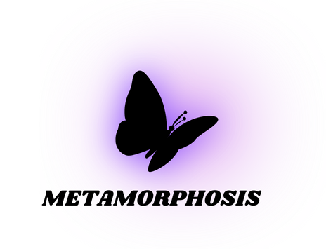

<div align="center">
  
#  Metamorphosis

**A Modern Change Management Dashboard**

[](https://nextjs.org/)
[](https://www.typescriptlang.org/)
[](https://supabase.com/)
[](https://ui.shadcn.com/)
[](https://tailwindcss.com/)
[](https://deepseek.ai/)
[](https://streamlit.io/)

</div>

## 📖 Overview

Metamorphosis is a comprehensive change management dashboard designed to help organizations navigate transitions effectively. It combines modern web technologies with AI-powered tools to provide insights, facilitate communication, and ensure successful change implementations.

## ✨ Key Features

- **Project Management Dashboard**: Track and manage organizational change initiatives
- **RAG-powered AI Chatbot**: Get intelligent answers to change management questions
- **Department-specific Views**: Tailored experience for each organizational department
- **Risk Assessment Tool**: Identify and mitigate potential project risks
- **Feedback System**: Collect and analyze stakeholder feedback
- **Resource Library**: Access change management resources and documentation
- **Admin Controls**: Manage users, projects, and announcements
- **Quiz Module**: Test knowledge retention and understanding
- **Offline Support**: Continue working even when connectivity is limited

## 🛠️ Tech Stack

### Frontend
- **Next.js 14**: React framework for server-side rendering and static site generation
- **TypeScript**: Type-safe JavaScript for robust application development
- **Shadcn UI**: High-quality UI components built with Radix UI and Tailwind
- **Tailwind CSS**: Utility-first CSS framework
- **Lucide Icons**: Beautiful, consistent open-source icons
- **React Hook Form**: Form validation and handling
- **Recharts**: Composable charting library for data visualization

### Backend
- **Supabase**: Open-source Firebase alternative for authentication and database
- **Node.js**: JavaScript runtime for server-side logic
- **Express**: Web framework for Node.js API endpoints

### AI & Machine Learning
- **DeepSeek API**: Advanced language model for intelligent responses
- **LangChain**: Framework for building LLM-powered applications
- **FAISS**: Library for efficient similarity search
- **Streamlit**: Python framework for data apps and visualizations

### Authentication & Security
- **Supabase Auth**: User authentication and authorization
- **Row-Level Security (RLS)**: Fine-grained access control at the database level

## 🏗️ Architecture

Metamorphosis follows a modern, scalable architecture:

1. **Next.js Frontend**: Server and client components with optimized rendering
2. **Supabase Backend**: PostgreSQL database with real-time subscriptions
3. **DeepSeek AI Layer**: RAG (Retrieval-Augmented Generation) system for context-aware responses
4. **API Services**: RESTful endpoints for data exchange between frontend and AI services

## 📱 Features in Detail

### AI-Powered Chatbot
The system integrates multiple AI models to provide contextual support for change management challenges:
- Retrieval-Augmented Generation for accurate, context-aware responses
- Document analysis for extracting insights from uploaded materials
- Change planning assistant for strategic guidance

### Risk Assessment Tool
Generate comprehensive risk reports with:
- Automated risk identification based on project parameters
- Mitigation strategy recommendations
- Severity and impact analysis
- Historical comparison with similar projects

### Feedback System
- Multi-channel feedback collection
- Sentiment analysis
- Trending topics identification
- Offline-first design with synchronization when connectivity is restored

## 🚀 Getting Started

### Prerequisites
- Node.js 18.17 or later
- Python 3.9+ (for AI components)
- Supabase account

### Installation

```bash
# Clone the repository
git clone https://github.com/yourusername/metamorphosis.git

# Install frontend dependencies
npm install

# Install Python dependencies
pip install -r requirements.txt

# Configure environment variables
cp .env.example .env.local

# Start the development server
npm run dev
```

### Environment Setup
Create a `.env.local` file with the following variables:

```
NEXT_PUBLIC_SUPABASE_URL=your-supabase-url
NEXT_PUBLIC_SUPABASE_ANON_KEY=your-supabase-anon-key
DEEPSEEK_API_KEY=your-deepseek-api-key
```

## 📝 Contributing

Contributions are welcome! Please feel free to submit a Pull Request.

## 📄 License

This project is licensed under the MIT License - see the LICENSE file for details.

---

<div align="center">
  <p>Developed by the Metamorphosis Team</p>
</div> 